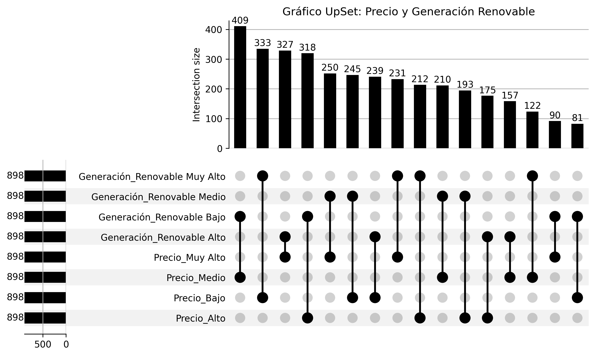

# PEC 2: Visualización de Datos - Gráfico UpSet

Este repositorio contiene el trabajo realizado para la PEC 2 de la asignatura de Visualización de Datos del Máster en Ciencia de Datos.

El objetivo es analizar las intersecciones y combinaciones frecuentes entre los niveles de precios de la electricidad y los niveles de generación Renovable en España. 
Para ello, se utiliza un **Gráfico UpSet**, una técnica específica para la visualización de conjuntos intersectados.

## Gráfico UPSET

Aquí se muestra el resultado final del análisis, generado por el script `PEC2-Upset.py` a partir del fichero de datos.



## Metodología del Análisis

El objetivo es encontrar patrones en las intersecciones de los siguientes conjuntos de días:

* **Fuente de Datos:** Los datos diarios de generación y precios provienen de `http://esios.ree.es/es` (Red Eléctrica).
* **Categorización de los datos:** El precio diario y la generación renovable se han clasificado en **cuatro niveles** (Muy Alto, Alto, Medio, Bajo) utilizando sus cuartiles (Q1, Q2, Q3).

El gráfico UpSet muestra la frecuencia (barras verticales) de cada combinación exacta de estos factores.

## Ejecución del Proyecto

Este repositorio contiene el script de Python (`PEC2-Upset.py`) usado para generar el gráfico a partir de un fichero `DataUpsetPEC2.csv` pre-procesado.

**Requisitos:**

pandas matplotlib upsetplot

*(Ver `requirements.txt`)*

**Ejecución:**
```bash
python PEC2-Upset.py
```

## Archivos del Repositorio

* **`PEC2-Upset.py`**: El script de Python que genera el gráfico.
* **`DataUpsetPEC2.csv`**: Los datos pre-procesados y categorizados.
* **`requirements.txt`**: Las dependencias de Python.
* **`grafico_upset.png`**: La imagen del gráfico final.

## Autor

**Gonzalo Martínez Carreras**